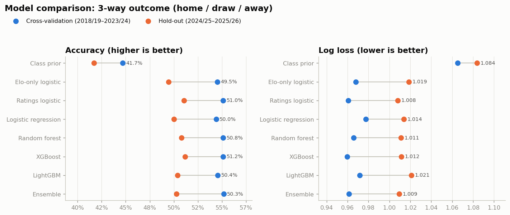
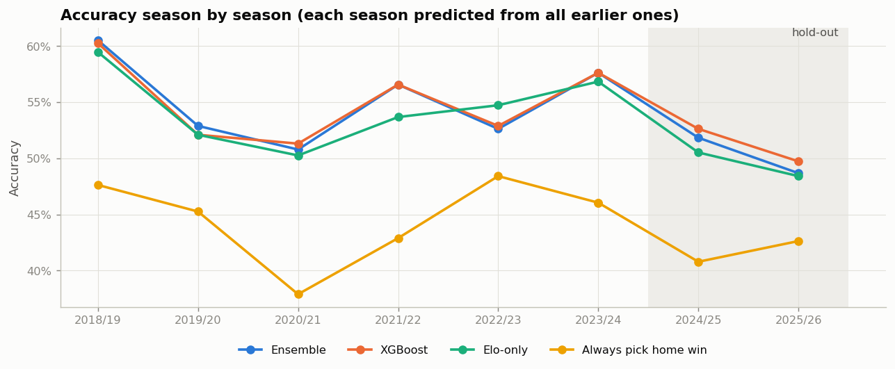
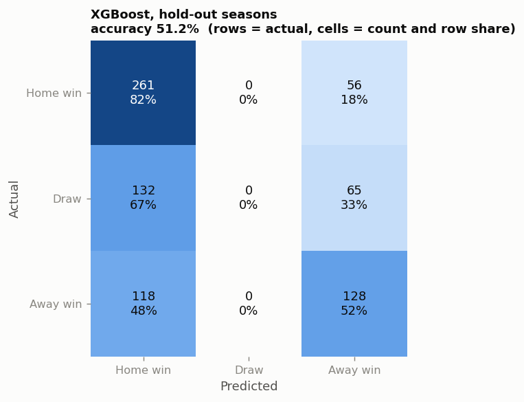
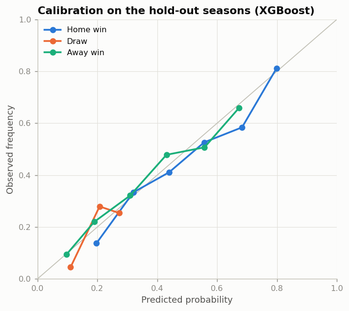
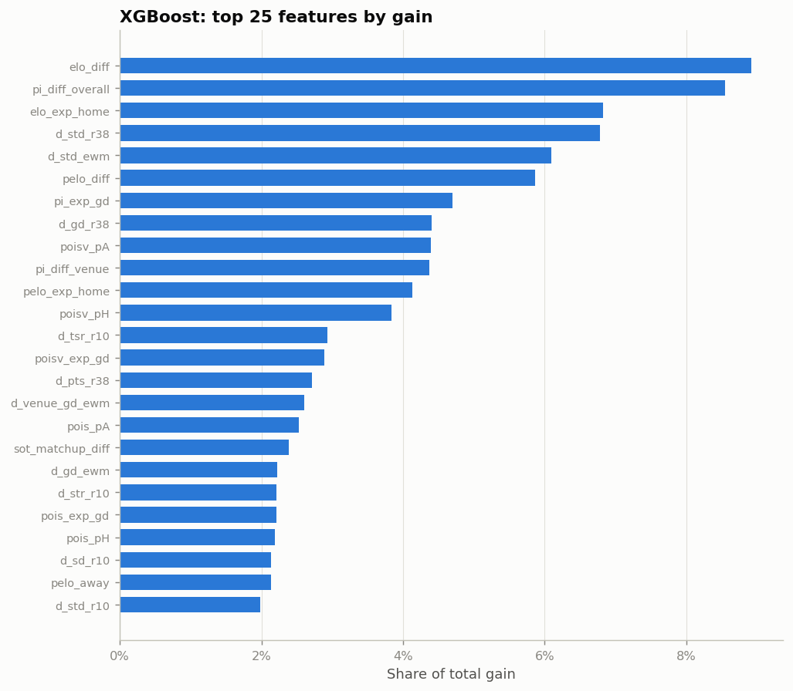
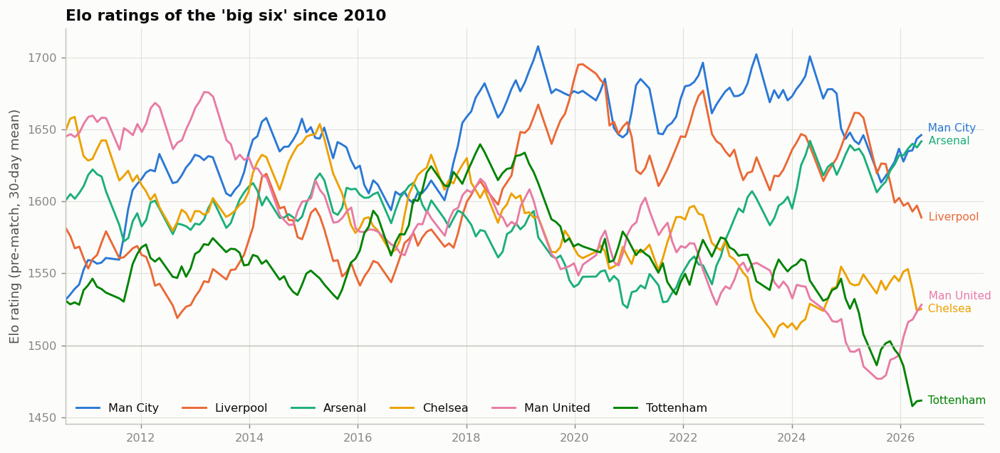

# Premier League match-outcome predictor

Predicts whether the **home team wins, draws, or loses** its next Premier League match,
using 33 seasons of historical data (1993/94 → 2025/26, 12,704 matches) and nothing that
would not be known before kick-off.

```
python -m epl_predictor.predict "Arsenal" "Chelsea"

Model: xgboost  |  data through 2026-05-24

2026-09-13  Arsenal vs Chelsea
   home 64.6%   draw 23.1%   away 12.3%   ->  Home win (65%)
   Elo 1622 v 1522   expected goals 1.99 - 0.82
```

## Results

Every season is predicted **only from earlier seasons** (expanding-window cross-validation over
2018/19 – 2023/24), and 2024/25 + 2025/26 are a final hold-out that was never used for tuning
or model selection.

| model | CV accuracy | CV log loss | CV RPS | hold-out accuracy | hold-out log loss | hold-out RPS |
|---|---|---|---|---|---|---|
| Class prior (always home win) | 44.7% | 1.065 | 0.2358 | 41.7% | 1.084 | 0.2324 |
| Elo-only logistic | 54.5% | 0.968 | 0.2013 | 49.5% | 1.019 | 0.2100 |
| Ratings logistic (14 features) | 55.1% | 0.961 | 0.1993 | 51.0% | 1.008 | 0.2059 |
| Logistic regression (all features) | 54.4% | 0.977 | 0.2016 | 50.0% | 1.014 | 0.2069 |
| Random forest | 55.1% | 0.966 | 0.1998 | 50.8% | 1.011 | 0.2060 |
| **XGBoost (Optuna-tuned, deployed)** | **55.1%** | **0.960** | **0.1987** | **51.2%** | 1.012 | 0.2061 |
| LightGBM | 54.6% | 0.972 | 0.2011 | 50.4% | 1.021 | 0.2084 |
| Ensemble (weighted average) | 55.2% | 0.962 | 0.1990 | 50.3% | 1.009 | 0.2058 |

CV = mean over the six cross-validation seasons (2,280 matches); hold-out = 760 matches.
The hold-out seasons were unusually hard to call — home wins fell to 42% of results and every
model, including the baselines, dropped by a similar amount (2024/25: 52.6%, 2025/26: 49.7% for XGBoost).
Draws are never the single most likely outcome, so an accuracy-maximising classifier never
predicts them; the draw *probabilities* are nonetheless well calibrated.

Context for those numbers: "always pick the home win" scores ~45%, an Elo-only model ~54%,
and bookmakers' closing odds — which fold in team news, injuries, lineups and the market's
collective knowledge — land at roughly 55% on this task. Three-way football results are
inherently noisy; the best any statistical model can do from match data alone is in the
mid-50s, and **the useful output is the probabilities, not just the label**: when the ensemble
is ≥ 60% confident it is right about two-thirds of the time (see
`reports/figures/accuracy_by_confidence_xgboost.png`).

|  |  |
|---|---|
|  |  |
|  |  |

## The web app: Formbook

`refresh_site.py` turns the model into a single-file web app — **Formbook** — that shows
the coming matchweek's forecasts in pools-coupon 1 / X / 2 form, the results so far with the
model's pre-match call on each, the live table with 20,000-run season projections (expected
points, title / top-four / relegation odds), a running scorecard against baselines, a team
explorer with Elo history, and an any-fixture predictor with a full 20×20 matchup heatmap.

```bash
python refresh_site.py            # pulls the latest results + fixtures, writes site/index.html
python refresh_site.py --offline  # rebuild from stored data only
```

### Running it on GitHub

`docs/index.html` is a standalone build of the same page. Turn on GitHub Pages
(**Settings → Pages → Deploy from a branch → `main` / `docs`**) and the app is live at
`https://<you>.github.io/<repo>/`. The `refresh-formbook` workflow (`.github/workflows/refresh.yml`)
rebuilds it every morning with the latest results, commits `docs/index.html` and lets Pages redeploy;
you can also trigger it by hand from the Actions tab. `tests.yml` runs the leakage tests on every push.

### The self-refreshing Claude artifact

The page is also published as a Claude artifact that **refreshes itself every morning at 7am ET**:
the published HTML carries a self-contained bundle (this package's source, the XGBoost model in
its JSON format, and the historical match table), and a scheduled task reads the page, unpacks
the bundle, fetches this season's results and fixtures from the openfootball project, rebuilds
the page and republishes it in place. `python -m epl_predictor.bundle unpack page.html DEST`
restores a runnable copy of the project from any published version.

## How it works

```
data.py      download 33 season CSVs (football-data.co.uk mirror) -> data/processed/matches.parquet
ratings.py   Elo (margin-of-victory, season regression), shots-on-target "performance Elo", pi-ratings
features.py  ~280 leak-free pre-match features per fixture       -> data/processed/features.parquet
models.py    baselines, logistic regressions, random forest, XGBoost, LightGBM, probability-averaging ensemble
train.py     season-based CV, Optuna tuning of XGBoost, hold-out evaluation, deploys the best model by CV log loss
evaluate.py  figures in reports/figures/
predict.py   CLI: scores any fixture as the next match of both sides given all played matches
live.py      this season's results and fixture list (openfootball), merged with the history
site.py      forecasts, projections, scorecard, team data -> the Formbook page (templates/site.html)
bundle.py    self-contained refresh bundle embedded in the published page
```

### Features (all computed from earlier matches only)

| family | what goes in |
|---|---|
| **Team strength** | Elo rating and Elo win expectation (with home advantage); *performance* Elo updated by share of shots on target instead of the scoreline; pi-ratings (separate home and away ratings, Constantinou & Fenton 2013); previous-season points per game and finishing position; promoted flag |
| **Recent form** | rolling 5- and 10-match and exponentially-weighted means of points, goals for/against, shots, shots on target, corners, fouls, cards; win/draw/loss rates; goals-per-shot and shots-on-target rates; total-shots ratio and shots-on-target ratio (the closest proxies for possession in this data); momentum = last-5 form minus 38-match baseline; unbeaten / winless streaks |
| **Home advantage** | home team's last-5 *home* form and away team's last-5 *away* form; each team's home-minus-away points EWMA; league-wide rolling home-win rate (captures the long decline and the 2020/21 empty-stadium season) |
| **Season context** | games played, season points per game and goal difference, live league position and points gap to the leader |
| **Match-up** | Poisson expected goals for each side (attack strength × opponent defence weakness × league scoring rate, overall and venue-specific) and the implied P(home)/P(draw)/P(away); attack-vs-defence differentials |
| **Head-to-head** | win/draw/loss rates and average goal difference over the last 6 meetings, and at this venue |
| **Schedule** | rest days since the last match, matches in the last 14 days |

Rolling features use `shift(1)` inside each team's history, ratings are recorded *before* each
update, and league tables are snapshotted strictly before the match date — `tests/test_features.py`
checks that flipping a result never changes that match's own features.

### Modelling protocol

* Training rows start in 2002/03 (shot statistics exist from 2000/01; two seasons warm the rolling windows).
* **Expanding-window CV:** for each of 2018/19 … 2023/24, fit on every earlier season and predict that one.
* **XGBoost tuning:** Optuna (TPE) over learning rate, depth, min child weight, subsampling, L1/L2, gamma; scored by mean CV log loss with early stopping per fold.
* **Ensemble:** weighted average of the compact ratings-logistic, full logistic regression, random forest, XGBoost and LightGBM probabilities (weights from CV log loss). The linear model is kept in on purpose — it is well calibrated and its mistakes are less correlated with the trees'.
* **Deployment:** the model with the best CV log loss is refit on *all* seasons and saved to `models/final_model.joblib`.
* Metrics: accuracy, log loss, multi-class Brier score and the ranked probability score (RPS, the standard scoring rule for football forecasts).

## Setup

```bash
python -m venv .venv && source .venv/bin/activate
pip install -r requirements.txt
```

## Usage

```bash
# full pipeline: download -> features -> tune + train -> evaluate (35 Optuna trials, ~30-45 min on a laptop)
python run_pipeline.py
# reuse the saved XGBoost parameters (~8 min)
python run_pipeline.py --quick
# pull the latest season files first (once the 2026/27 file exists in the mirror)
python run_pipeline.py --quick --refresh-data

# predictions
python -m epl_predictor.predict "Man City" "Liverpool" --date 2026-09-20
python -m epl_predictor.predict --fixtures my_fixtures.csv --csv predictions.csv   # HomeTeam,AwayTeam[,Date]
python -m epl_predictor.predict --teams                                             # valid team names

# tests
python -m pytest -q
```

Team names accept common aliases (`spurs`, `Man Utd`, `Manchester City`, `Forest`, …).
`notebooks/walkthrough.ipynb` tells the whole story with plots.

## Data

[football-data.co.uk](https://www.football-data.co.uk/englandm.php) Premier League files, via the
[datasets/football-datasets](https://github.com/datasets/football-datasets) GitHub mirror (one CSV per season:
date, teams, full/half-time score, referee, shots, shots on target, fouls, corners, cards). The mirror
strips the bookmaker-odds columns, and possession is not available from this source — shot-share
ratios stand in for it. Adding a per-match possession/xG column (e.g. from FBref or Understat) to
`data/processed/matches.parquet` is all that is needed to feed it through the same pipeline.

## Project layout

```
epl-match-predictor/
├── run_pipeline.py            one-shot: train + evaluate
├── refresh_site.py            rebuild the Formbook web app with the latest results
├── docs/index.html            standalone build of the web app, served by GitHub Pages
├── site/index.html            artifact build of the web app (single file, bundle embedded)
├── .github/workflows/         tests on push; daily refresh of docs/index.html
├── src/epl_predictor/         the package (config, data, ratings, features, models, metrics, train, evaluate, predict, live, site, bundle)
├── notebooks/walkthrough.ipynb
├── tests/test_features.py     leakage / correctness checks
├── data/raw/                  season CSVs          data/processed/  matches + features (parquet/csv)
├── models/                    final_model.joblib, xgb_params.json, metrics.json
└── reports/                   cv_results.csv, holdout_results.csv, figures/
```
